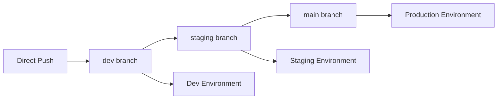

# ${{ values.component_id }}

${{ values.description }}

## 🚀 Quick Start

### Local Development
```bash
# Install dependencies
npm install

# Start development server
npm run dev

# Run tests
npm test
```

### Docker Development
```bash
# Build Docker image
npm run docker:build

# Run in container
npm run docker:run

# Stop container
npm run docker:stop
```

## 🌍 Environment Management

This service supports three environments with separate configurations and deployments:

### Environments

| Environment | Branch    | Auto-Deploy | Purpose           |
|------------|-----------|-------------|-------------------|
| Development| `dev` (default) | ✅ Yes      | Feature development and testing |
| Staging    | `staging` | ✅ Yes      | Pre-production testing |
| Production | `main`    | ✅ Yes      | Live production services |

### Environment Configuration

Each environment has its own configuration file:
- `.env.dev` - Development settings (low resources, debug logging)
- `.env.staging` - Staging settings (moderate resources, info logging)  
- `.env.prod` - Production settings (high resources, minimal logging)

### Development Workflow (Industry Standard)



1. **New Service**: Repository created with `dev` as default branch → Auto-deploy to dev
2. **Feature Development**: 
   - Push directly to `dev` branch (no PR required)
   - Push triggers dev deployment automatically
3. **Staging Release**: 
   - Create PR from `dev` to `staging`
   - Merge triggers staging deployment
4. **Production Release**: 
   - Create PR from `staging` to `main`
   - Merge triggers production deployment

### Branch Protection Rules

| Branch   | Direct Commits | PR Required | Purpose           |
|----------|----------------|-------------|-------------------|
| dev      | ✅ Allowed     | ❌ No       | Fast development iteration |
| staging  | ❌ Blocked     | ✅ Yes      | Pre-production testing |
| main     | ❌ Blocked     | ✅ Yes      | Production releases |

### Quick Start After Repo Creation

**Option 1: Automatic Setup (preferred)**
The repository should automatically set up environment branches via GitHub Actions.

**Option 2: Manual Setup (if automatic fails)**

```bash
# Clone your new repository
git clone <your-repo-url>
cd ${{ values.component_id }}

# The repo starts with 'dev' as default branch
# Create staging and main branches:
git checkout -b staging
git push origin staging

git checkout -b main  
git push origin main

# Return to dev branch for development
git checkout dev

# Start developing
git add .
git commit -m "Initial development"
git push origin dev  # This will deploy to development environment
```

### Development Workflow

1. **Development**: Push directly to `dev` branch → Auto-deploy to dev environment
2. **Staging**: Create PR `dev → staging` → Auto-deploy to staging environment  
3. **Production**: Create PR `staging → main` → Auto-deploy to production environment

### Manual Deployment

You can also deploy manually to any environment:

```bash
# Deploy to development
npm run deploy:dev

# Deploy to staging  
npm run deploy:staging

# Deploy to production
npm run deploy:production
```

### Environment Secrets

Each environment requires its own GitHub Secrets:

**Development:**
- `GCP_PROJECT_ID_DEV`: Your GCP project ID for development
- `GCP_SA_KEY_DEV`: Service Account Key (JSON) for development

**Staging:**
- `GCP_PROJECT_ID_STAGING`: Your GCP project ID for staging
- `GCP_SA_KEY_STAGING`: Service Account Key (JSON) for staging

**Production:**
- `GCP_PROJECT_ID_PROD`: Your GCP project ID for production
- `GCP_SA_KEY_PROD`: Service Account Key (JSON) for production

## ☁️ Cloud Deployment

### Prerequisites
1. **Google Cloud Projects** - Separate projects for each environment (recommended)
2. **gcloud CLI** installed and authenticated
3. **Docker** installed locally
```bash
# Option 1: Use automated setup script
chmod +x setup-gcp.sh
./setup-gcp.sh

# Option 2: Manual setup
# Install gcloud CLI (if not already installed)
# https://cloud.google.com/sdk/docs/install

# Authenticate
gcloud auth login

# Set your project
gcloud config set project YOUR-PROJECT-ID

# Enable required APIs
gcloud services enable run.googleapis.com
gcloud services enable containerregistry.googleapis.com

# Configure Docker for GCR
gcloud auth configure-docker
```

### GitHub Secrets Setup
**Required for automatic deployment:**

1. **Create Service Account Key:**
   - Go to [Google Cloud Console](https://console.cloud.google.com)
   - Navigate to **IAM & Admin** → **Service Accounts**
   - Create service account with these roles:
     - Cloud Run Admin
     - Storage Admin  
     - Service Account User
   - Create JSON key and download it

2. **Add GitHub Secrets:**
   - Go to repository **Settings** → **Secrets and variables** → **Actions**
   - Add secrets:
     - `GCP_PROJECT_ID`: Your GCP project ID
     - `GCP_SA_KEY`: Complete JSON content of the service account key

### Manual Deployment
```bash
# Deploy to staging
npm run deploy:staging

# Deploy to production  
npm run deploy:production
```

### Automatic Deployment (CI/CD)
When you push to the `main` branch, GitHub Actions will automatically:

1. ✅ Run tests
2. ✅ Build Docker image
3. ✅ Push to Google Container Registry
4. ✅ Deploy to Google Cloud Run

**Required GitHub Secrets:**
- `GCP_PROJECT_ID`: Your Google Cloud Project ID
- `GCP_SA_KEY`: Service Account Key (JSON)

## 📊 Service Information

- **Port:** 3001
- **Health Check:** `/health`
- **Main Endpoint:** `/`

## 🔗 Useful Links

- **Backstage Catalog:** [View in Backstage](http://localhost:3000)
- **GitHub Repository:** [View on GitHub](https://github.com/${{ values.owner }}/${{ values.component_id }})
- **Cloud Run Console:** [View in GCP Console](https://console.cloud.google.com/run)

## 📋 Available Scripts

| Script | Description |
|--------|-------------|
| `npm start` | Start production server |
| `npm run dev` | Start development server with hot reload |
| `npm test` | Run tests |
| `npm run docker:build` | Build Docker image |
| `npm run docker:run` | Run Docker container locally |
| `npm run docker:stop` | Stop Docker container |
| `npm run deploy:dev` | Deploy to development environment |
| `npm run deploy:staging` | Deploy to staging environment |
| `npm run deploy:production` | Deploy to production environment |
| `npm run env:dev` | Set development environment variables |
| `npm run env:staging` | Set staging environment variables |
| `npm run env:prod` | Set production environment variables |

## 🛠️ Development Guide

### Adding New Endpoints
```javascript
// Add to index.js
app.get('/api/new-endpoint', (req, res) => {
  res.json({ message: 'Hello from new endpoint!' });
});
```

### Environment Variables
Create a `.env` file for local development:
```
NODE_ENV=development
PORT=3001
```

### Testing
Add tests to `test.js` or create new test files.

## 📞 Support

Created with ❤️ using Backstage IDP

- **Owner:** ${{ values.owner }}
- **Component:** ${{ values.component_id }}
- **Template:** Node.js Microservice Template

The service will be available at `http://localhost:3000`

## API Endpoints

- `GET /` - Returns service information
- `GET /health` - Health check endpoint

## Owner

This service is owned by: ${{ values.owner }}
