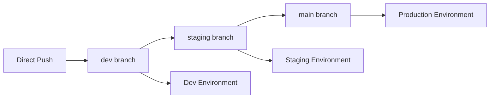

# ${{ values.component_id }}

${{ values.description }}

## 🚀 Quick Start

### Prerequisites
- Node.js 18+ 
- Docker
- Google Cloud CLI (if deploying to GCP)
- kubectl (for GKE deployments)
- Terraform (for infrastructure provisioning)

### Local Development

1. **Install dependencies:**
   ```bash
   npm install
   ```

2. **Set up environment variables:**
   ```bash
   # Copy the appropriate environment file
   npm run env:dev  # or env:staging, env:prod
   ```

3. **Start the development server:**
   ```bash
   npm run dev
   ```

4. **Run tests:**
   ```bash
   npm test
   ```

The service will be available at `http://localhost:3001`

### 🔧 Configuration

This service is configured for:
- **Cloud Provider:** ${{ values.cloudProvider | upper }}
- **Deployment Type:** ${{ values.deploymentType | upper }}
- **GKE Cluster:** ${{ values.gkeClusterName }}
- **GKE Region:** ${{ values.gkeRegion }}
- **GKE Namespace:** ${{ values.gkeNamespace }}
- **Infrastructure:** Automated provisioning enabled
  - Database: ${{ values.infraDatabase | upper }}
  - Storage: Cloud Storage bucket

### 📁 Project Structure

```
${{ values.component_id }}/
├── index.js                 # Main application file (REPLACE WITH YOUR CODE)
├── package.json             # Dependencies and scripts
├── Dockerfile              # Container configuration
├── .github/workflows/       # CI/CD pipelines
│   └── ci-cd.yml           # Main deployment workflow
│   └── infrastructure.yml   # Infrastructure provisioning
├── infrastructure/         # Terraform configuration
│   ├── main.tf
│   ├── variables.tf
│   ├── resources.tf
│   └── outputs.tf
├── k8s/                    # Kubernetes manifests
│   ├── deployment.yaml
│   └── service.yaml
├── deploy/                 # Deployment scripts
└── .env.*                  # Environment configurations
```

### 🔄 Replacing Boilerplate Code

The `index.js` file contains a basic Express.js setup. To replace it with your own application:

1. **Keep the health check endpoint** - Required for cloud deployments:
   ```javascript
   app.get('/health', (req, res) => {
     res.json({ status: 'healthy' });
   });
   ```

2. **Replace the section between the markers:**
   ```javascript
   // ========================================
   // YOUR APPLICATION CODE STARTS HERE
   // ========================================
   
   // Replace everything between these markers with your code
   
   // ========================================
   // YOUR APPLICATION CODE ENDS HERE
   // ========================================
   ```

3. **Keep the error handling and server startup code** at the bottom of the file.

### 🚀 Deployment

#### Automatic Deployment (Recommended)
The service deploys automatically via GitHub Actions:

- **Push to `dev`** → Deploys to development environment
- **Push to `staging`** → Deploys to staging environment  
- **Push to `main`** → Deploys to production environment

#### Required GitHub Secrets

Set these in your GitHub repository settings:

**Authentication:**
- `GCP_SA_KEY` - Service account key (JSON)
- Or environment-specific: `GCP_SA_KEY_DEV`, `GCP_SA_KEY_STAGING`, `GCP_SA_KEY_PROD`

**Project IDs:**
- `GCP_PROJECT_ID` - Default project ID
- Or environment-specific: `GCP_PROJECT_ID_DEV`, `GCP_PROJECT_ID_STAGING`, `GCP_PROJECT_ID_PROD`

### 🏗️ Infrastructure Provisioning

Infrastructure is automatically provisioned using Terraform:

**Database:** ${{ values.infraDatabase | upper }} Cloud SQL instance
- Automatically creates database and user
- Outputs connection details

**Storage:** Google Cloud Storage bucket
- Versioning enabled
- IAM permissions configured

**To provision infrastructure manually:**
```bash
npm run infra:init
npm run infra:plan
npm run infra:apply
```

**Infrastructure deployment:**
- Triggers automatically on pushes to `main`
- Can be manually triggered via GitHub Actions
- Uses separate Terraform state per environment

### 🐳 Docker

**Build the image:**
```bash
npm run docker:build
```

**Run locally:**
```bash
npm run docker:run
```

**Stop container:**
```bash
npm run docker:stop
```

### 🔍 Monitoring

**Health Check:**
- Endpoint: `/health`
- Returns service status and metadata

**Logs:**
- Cloud Run: `gcloud logs read --service=${{ values.component_id }}`
- GKE: `kubectl logs -l app=${{ values.component_id }} -n ${{ values.gkeNamespace }}`

### 📚 API Documentation

Once you replace the boilerplate code, document your API endpoints here:

- `GET /` - Welcome endpoint
- `GET /health` - Health check
- `GET /api/example` - Example endpoint (replace with your endpoints)

### 🤝 Contributing

1. Create a feature branch
2. Make your changes
3. Test locally
4. Push to trigger CI/CD
5. Create a pull request

### 📧 Support

For questions or issues:
- Check the logs in Google Cloud Console
- Review GitHub Actions workflow runs
- Contact: ${{ values.owner }}

---

**Generated by Backstage IDP** - ${{ values.component_id }}
| Development| `dev` (default) | ✅ Yes      | Feature development and testing |
| Staging    | `staging` | ✅ Yes      | Pre-production testing |
| Production | `main`    | ✅ Yes      | Live production services |

### Environment Configuration

Each environment has its own configuration file:
- `.env.dev` - Development settings (low resources, debug logging)
- `.env.staging` - Staging settings (moderate resources, info logging)  
- `.env.prod` - Production settings (high resources, minimal logging)

### Development Workflow (Industry Standard)



1. **New Service**: Repository created with `dev` as default branch → Auto-deploy to dev
2. **Feature Development**: 
   - Push directly to `dev` branch (no PR required)
   - Push triggers dev deployment automatically
3. **Staging Release**: 
   - Create PR from `dev` to `staging`
   - Merge triggers staging deployment
4. **Production Release**: 
   - Create PR from `staging` to `main`
   - Merge triggers production deployment

### Branch Protection Rules

| Branch   | Direct Commits | PR Required | Purpose           |
|----------|----------------|-------------|-------------------|
| dev      | ✅ Allowed     | ❌ No       | Fast development iteration |
| staging  | ❌ Blocked     | ✅ Yes      | Pre-production testing |
| main     | ❌ Blocked     | ✅ Yes      | Production releases |

### Quick Start After Repo Creation



**Option 1: Automatic Setup (preferred)**
The repository should automatically set up environment branches via GitHub Actions.

**Option 2: Manual Setup (if automatic fails)**

```bash
# Clone your new repository
git clone https://github.com/${{ values.destination.owner }}/${{ values.destination.repo }}.git
cd ${{ values.component_id }}

# Run the branch setup script
chmod +x setup-branches.sh
./setup-branches.sh

# Start developing
git add .
git commit -m "Initial development"
git push origin dev  # This will deploy to development environment
```



**Manual Setup Required**

```bash
# Clone your new repository
git clone https://bitbucket.org/${{ values.destination.owner }}/${{ values.destination.repo }}.git
cd ${{ values.component_id }}

# Run the branch setup script
chmod +x setup-branches.sh
./setup-branches.sh

# Start developing
git add .
git commit -m "Initial development"
git push origin dev  # This will deploy to development environment
```

**Note**: For Bitbucket, you'll need to manually configure branch permissions and deployment environments in the Bitbucket repository settings.



### Development Workflow

1. **Development**: Push directly to `dev` branch → Auto-deploy to dev environment
2. **Staging**: Create PR `dev → staging` → Auto-deploy to staging environment  
3. **Production**: Create PR `staging → main` → Auto-deploy to production environment

### Manual Deployment

You can also deploy manually to any environment:

```bash
# Deploy to development
npm run deploy:dev

# Deploy to staging  
npm run deploy:staging

# Deploy to production
npm run deploy:production
```

### Environment Secrets



Each environment requires its own GitHub Secrets:

**Development:**
- `GCP_PROJECT_ID_DEV`: Your GCP project ID for development
- `GCP_SA_KEY_DEV`: Service Account Key (JSON) for development

**Staging:**
- `GCP_PROJECT_ID_STAGING`: Your GCP project ID for staging
- `GCP_SA_KEY_STAGING`: Service Account Key (JSON) for staging

**Production:**
- `GCP_PROJECT_ID_PROD`: Your GCP project ID for production
- `GCP_SA_KEY_PROD`: Service Account Key (JSON) for production

**How to set GitHub Secrets:**
1. Go to your repository settings
2. Navigate to "Secrets and variables" > "Actions"
3. Add the required secrets for each environment



Each environment requires its own Bitbucket Repository Variables:

**Development:**
- `GCP_PROJECT_ID_DEV`: Your GCP project ID for development
- `GCP_SA_KEY_DEV`: Service Account Key (JSON) for development

**Staging:**
- `GCP_PROJECT_ID_STAGING`: Your GCP project ID for staging
- `GCP_SA_KEY_STAGING`: Service Account Key (JSON) for staging

**Production:**
- `GCP_PROJECT_ID_PROD`: Your GCP project ID for production
- `GCP_SA_KEY_PROD`: Service Account Key (JSON) for production

**How to set Bitbucket Variables:**
1. Go to your repository settings
2. Navigate to "Repository variables"
3. Add the required variables for each environment
4. Mark sensitive variables as "Secured"



## ☁️ Cloud Deployment

### Prerequisites
1. **Google Cloud Projects** - Separate projects for each environment (recommended)
2. **gcloud CLI** installed and authenticated
3. **Docker** installed locally
```bash
# Option 1: Use automated setup script
chmod +x setup-gcp.sh
./setup-gcp.sh

# Option 2: Manual setup
# Install gcloud CLI (if not already installed)
# https://cloud.google.com/sdk/docs/install

# Authenticate
gcloud auth login

# Set your project
gcloud config set project YOUR-PROJECT-ID

# Enable required APIs
gcloud services enable run.googleapis.com
gcloud services enable containerregistry.googleapis.com

# Configure Docker for GCR
gcloud auth configure-docker
```

### GitHub Secrets Setup
**Required for automatic deployment:**

1. **Create Service Account Key:**
   - Go to [Google Cloud Console](https://console.cloud.google.com)
   - Navigate to **IAM & Admin** → **Service Accounts**
   - Create service account with these roles:
     - Cloud Run Admin
     - Storage Admin  
     - Service Account User
   - Create JSON key and download it

2. **Add GitHub Secrets:**
   - Go to repository **Settings** → **Secrets and variables** → **Actions**
   - Add secrets:
     - `GCP_PROJECT_ID`: Your GCP project ID
     - `GCP_SA_KEY`: Complete JSON content of the service account key

### Manual Deployment
```bash
# Deploy to staging
npm run deploy:staging

# Deploy to production  
npm run deploy:production
```

### Automatic Deployment (CI/CD)
When you push to the `main` branch, GitHub Actions will automatically:

1. ✅ Run tests
2. ✅ Build Docker image
3. ✅ Push to Google Container Registry
4. ✅ Deploy to Google Cloud Run

**Required GitHub Secrets:**
- `GCP_PROJECT_ID`: Your Google Cloud Project ID
- `GCP_SA_KEY`: Service Account Key (JSON)

## 📊 Service Information

- **Port:** 3001
- **Health Check:** `/health`
- **Main Endpoint:** `/`

## 🔗 Useful Links

- **Backstage Catalog:** [View in Backstage](http://localhost:3000)
- **GitHub Repository:** [View on GitHub](https://github.com/${{ values.owner }}/${{ values.component_id }})
- **Cloud Run Console:** [View in GCP Console](https://console.cloud.google.com/run)

## 📋 Available Scripts

| Script | Description |
|--------|-------------|
| `npm start` | Start production server |
| `npm run dev` | Start development server with hot reload |
| `npm test` | Run tests |
| `npm run docker:build` | Build Docker image |
| `npm run docker:run` | Run Docker container locally |
| `npm run docker:stop` | Stop Docker container |
| `npm run deploy:dev` | Deploy to development environment |
| `npm run deploy:staging` | Deploy to staging environment |
| `npm run deploy:production` | Deploy to production environment |
| `npm run env:dev` | Set development environment variables |
| `npm run env:staging` | Set staging environment variables |
| `npm run env:prod` | Set production environment variables |

## 🛠️ Development Guide

### Adding New Endpoints
```javascript
// Add to index.js
app.get('/api/new-endpoint', (req, res) => {
  res.json({ message: 'Hello from new endpoint!' });
});
```

### Environment Variables
Create a `.env` file for local development:
```
NODE_ENV=development
PORT=3001
```

### Testing
Add tests to `test.js` or create new test files.

## 📞 Support

Created with ❤️ using Backstage IDP

- **Owner:** ${{ values.owner }}
- **Component:** ${{ values.component_id }}
- **Template:** Node.js Microservice Template

The service will be available at `http://localhost:3000`

## API Endpoints

- `GET /` - Returns service information
- `GET /health` - Health check endpoint

## Owner

This service is owned by: ${{ values.owner }}
